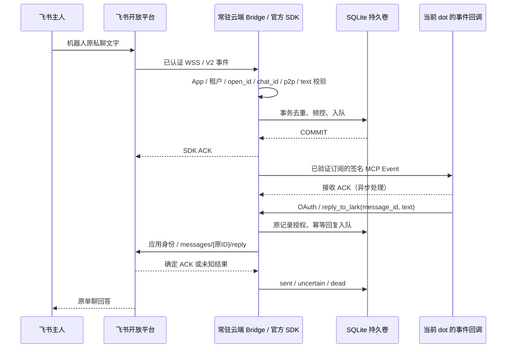

# 架构

原型没有另建 AI 助手。它只传递已验证文字与回答；事件由订阅所在的现有 dot 处理。数据库不保存 dot 记忆或模型会话。

## 入口及身份

`src/lark-runtime.js` 将官方 `WSClient` 接到专用 `EventDispatcher`。HTTP 服务没有飞书接收路由。WSS 发现使用应用 AppID/Secret；外部人不能通过向 `/mcp` 发一个飞书 JSON 来入队。

原 V2 `schema/header` 在 SDK 合并字段前校验，阻止 event 覆盖 header。之后校验 sender 的租户、`sender_type=user`、主人 `sender_id.open_id`、固定 `p2p` / `chat_id`、时间及纯文本 JSON。SDK 返回处理结果前同步提交 SQLite。被过滤的数据 ACK 后丢弃；无订阅、容量不足、频控或存储失败会向 SDK 抛错，使 SDK 返回错误 ACK，等待平台的有限重投。

一个配置绑定元组为 `(AppID, tenant_key, owner_open_id, owner_chat_id, MCP subject)`。数据库首次完整配置后固定此元组；换身份必须使用新库，不能修改环境继续复用旧消息。AppSecret 可轮换，存储密钥不可直接替换。

## MCP 与订阅

`src/server.js` 实现无状态 HTTP MCP 2.0 请求校验；`auth.js` 是资源服务器。只有已配置的 OAuth `sub`、正确发行方/资源 audience/scope/签名/期限可调用工具或订阅。`clientInfo` 不参与身份认证。

只有一个 active callback。订阅 ID 来自主体、URL、事件名和规范化参数；签名 challenge 成功后才激活。回调必须在明确主机白名单中，连接时重新查 DNS 并锁定公网地址、保留 TLS SNI，不跟随跳转。

每次重新激活已撤销或到期订阅都会产生新的 generation，旧消息不能重新被 read/reply 授权。持久 epoch 阻止并发验证请求在 unsubscribe 后晚到并重新激活。正常到期前刷新保持 generation；签名密钥轮换在 5 分钟内双签。

服务不接收 dot ID，也不能检查或指定私有记忆。它只能把事件发到已鉴权订阅者提供并验证的一个回调。操作者必须在目标现有 dot 中创建订阅，随后实测回到该 dot；不能把另一个 Work chat 的订阅当作同一 dot。

## 存储与故障语义

`store.js` 使用 SQLite WAL、`synchronous=FULL`、事务容量与频控、独占 claim 和随机 lease token。消息 ID、源事件 ID 唯一；稳定 MCP event ID 跨重试保存。单条正文和回答以及 callback secret/URL 使用 AES-256-GCM + 上下文 AAD 加密。路由身份和状态为明文元数据，需要卷 ACL / 磁盘加密保护。

| 工作类型 | 恢复行为 |
| --- | --- |
| 事件 pending / processing lease 到期 | 同 event ID 有界重试；接收方可能重复收到 |
| 回复 pending | 检查期限、订阅、generation 和固定身份后发送 |
| 回复 processing lease 到期 | `uncertain`；自动发送停止 |
| 回复响应 401 / 429 | 明确拒绝后允许有界重试，UUID 与原 ID 不变 |
| 回复超时 / 5xx / ACK 无法解析 / chat 不符 | `uncertain`；不重发 |
| 明确 API 错误 / redirect / 其他 HTTP 拒绝 | `dead` |
| 撤销 / 身份失效 / 期限过去 | `cancelled` / `expired` |

一条入站最多一份回答。重复相同 text 返回既有状态，不同 text 拒绝。`pending` 表示入队，`sent` 表示飞书 API 的确定 ACK，不代表用户已读。稳定 `uuid` 是额外防重措施，不能将未知结果变成 exactly-once 保证。

撤销在 token 刷新后、DNS 后和连接前复查。在网络上已经发出的请求不能被撤回；若它随后收到确定 ACK，记录 sent，避免用户误以为未发而重试。HTTP shutdown 等待当前 worker，SDK close 停止重连，之后关闭数据库。

正文 7 天后逻辑清除，去重 tombstone 长期保存。WAL、备份和磁盘旧页不保证立即物理擦除。未有 active 订阅时不会保存新的主人消息；平台错过/超出重投窗口的事件不能通过此桥自动补回。
